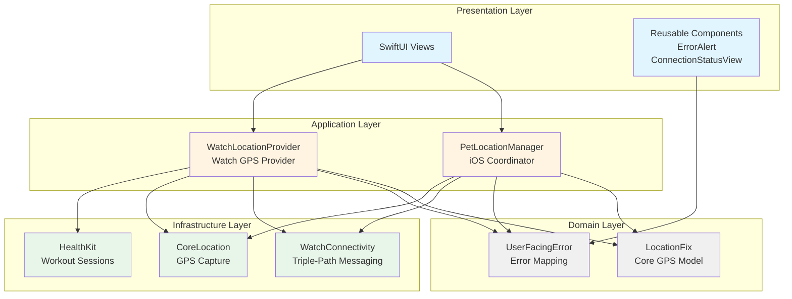
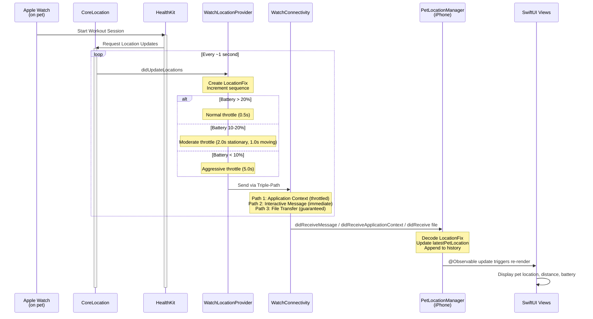
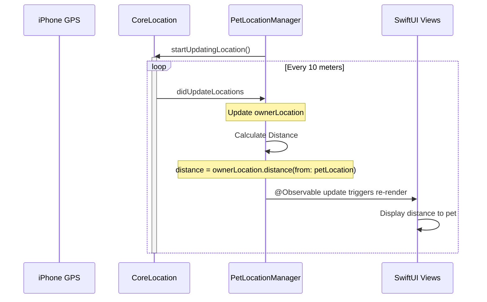
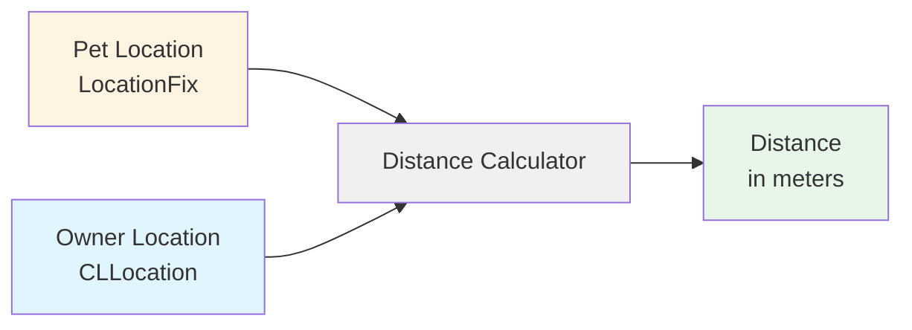
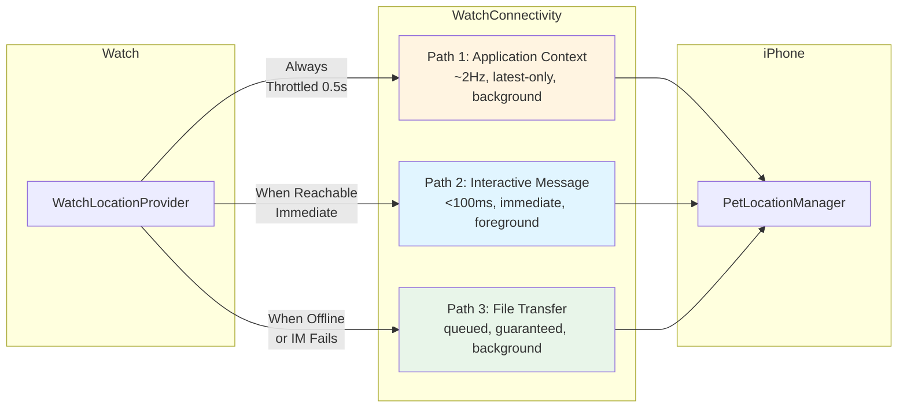
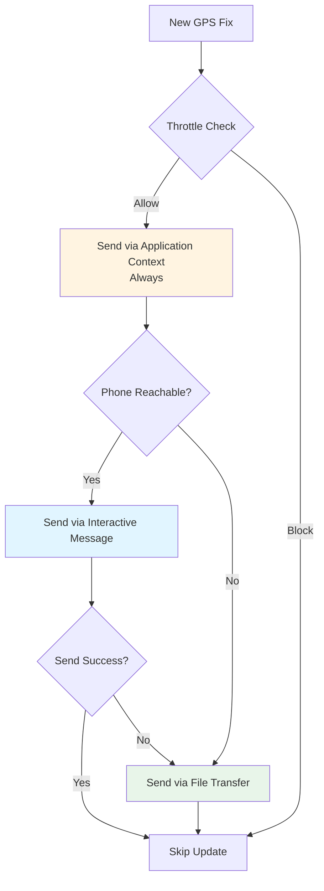
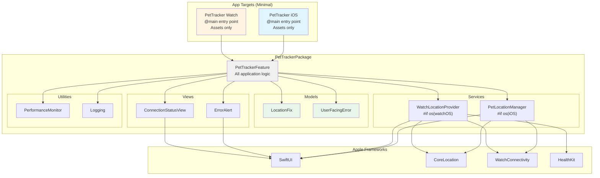
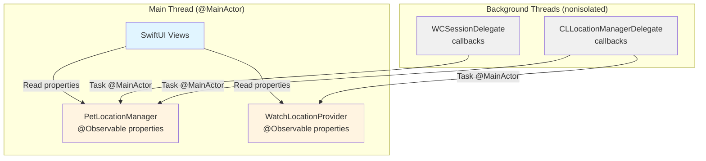
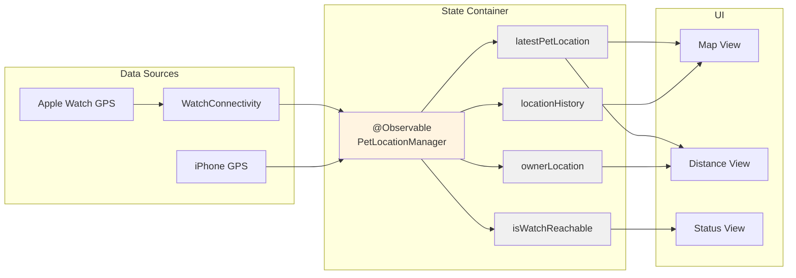

# PetTracker Architecture

**Version**: 0.1.0
**Last Updated**: 2025-11-08
**Swift**: 6.2.1
**iOS**: 26.0+
**watchOS**: 26.0+

---

## Table of Contents

1. [Overview](#overview)
2. [Clean Architecture Layers](#clean-architecture-layers)
3. [Data Flow](#data-flow)
4. [Triple-Path Messaging](#triple-path-messaging)
5. [Module Dependencies](#module-dependencies)
6. [Concurrency Model](#concurrency-model)
7. [State Management](#state-management)
8. [Design Decisions](#design-decisions)

---

## Overview

PetTracker transforms an Apple Watch into a real-time GPS tracker for pets. The Watch captures GPS coordinates while attached to a pet's collar and wirelessly transmits location data to the owner's iPhone for live monitoring, distance calculation, and trail visualization.

**Core Architecture Principles**:
- Clean Architecture with strict layer separation
- Swift Concurrency (@Observable, MainActor, async/await)
- Single Swift Package for all logic (app targets are minimal shells)
- Platform-specific code isolated via `#if os()` directives
- No ViewModel layer (SwiftUI views consume @Observable models directly)

---

## Clean Architecture Layers

PetTracker follows Clean Architecture with four distinct layers:



### Layer Responsibilities

#### Presentation Layer
- **Location**: `Views/` and `Views/Components/`
- **Purpose**: User interface with no business logic
- **Pattern**: SwiftUI views consuming @Observable models
- **Dependencies**: Application layer only

**Key Components**:
- `ErrorAlert`: View modifier for error presentation
- `ConnectionStatusView`: WatchConnectivity status display

**Rules**:
- No direct framework imports (except SwiftUI)
- No business logic (calculations, validations, etc.)
- All state from @Observable models

#### Application Layer
- **Location**: `Services/`
- **Purpose**: Coordinates business logic and manages state
- **Pattern**: @Observable for reactive state management
- **Dependencies**: Domain layer, Infrastructure layer

**Key Services**:
- `PetLocationManager` (iOS): Receives Watch locations, tracks owner location, calculates distance
- `WatchLocationProvider` (watchOS): Captures GPS, manages HealthKit workout, transmits to iPhone

**Rules**:
- All UI-related properties are @MainActor
- Delegates are nonisolated (dispatch to MainActor)
- No direct UI references

#### Domain Layer
- **Location**: `Models/`
- **Purpose**: Core business entities with no framework dependencies
- **Pattern**: Pure Swift value types
- **Dependencies**: None (except Foundation for Date/UUID)

**Key Models**:
- `LocationFix`: GPS data model (Codable, Sendable, Identifiable)
- `UserFacingError`: Error mapping with recovery suggestions

**Rules**:
- No framework imports (CoreLocation types converted at boundaries)
- All types are Sendable
- Immutable value types preferred

#### Infrastructure Layer
- **Location**: Platform frameworks (WatchConnectivity, CoreLocation, HealthKit)
- **Purpose**: Platform-specific integrations
- **Pattern**: Wrapped by Application layer services
- **Dependencies**: None (lowest layer)

**Key Integrations**:
- WatchConnectivity: Triple-path messaging
- CoreLocation: GPS capture
- HealthKit: Workout sessions for extended runtime

---

## Data Flow

### Watch → iPhone (Pet Location)

This is the primary data flow: Apple Watch captures GPS data and transmits to iPhone.



### iPhone → iPhone (Owner Location)

iPhone tracks owner's location independently:



### Distance Calculation



**Algorithm**:
```swift
guard let petFix = latestPetLocation,
      let owner = ownerLocation else {
    return nil
}
return owner.distance(from: petFix.clLocation)
```

Uses CoreLocation's built-in Haversine formula for great-circle distance.

---

## Triple-Path Messaging

WatchConnectivity uses three complementary delivery mechanisms for maximum reliability:



### Path 1: Application Context

**Characteristics**:
- Background delivery (works when apps are suspended)
- Latest-only (newest replaces old)
- Throttled to 0.5s interval
- Bypasses throttle if accuracy changes >5m
- ~2Hz max update rate

**Use Case**: Continuous background location updates

**Implementation**:
```swift
func sendViaApplicationContext(_ fix: LocationFix) {
    let now = Date()
    guard now.timeIntervalSince(lastContextUpdate) > 0.5 ||
          abs(fix.horizontalAccuracyMeters - lastAccuracy) > 5.0 else {
        return // Throttled
    }

    try? session.updateApplicationContext(fix.jsonDict)
    lastContextUpdate = now
}
```

### Path 2: Interactive Messages

**Characteristics**:
- Foreground delivery (requires Bluetooth reachability)
- Immediate delivery (<100ms latency)
- Not queued (fails if not reachable)
- Supports reply handlers

**Use Case**: Real-time updates when devices are active

**Implementation**:
```swift
func sendViaInteractiveMessage(_ fix: LocationFix) {
    guard session.isReachable else { return }

    session.sendMessage(fix.jsonDict) { reply in
        print("Ack received")
    } errorHandler: { error in
        // Fall back to file transfer
        sendViaFileTransfer(fix)
    }
}
```

### Path 3: File Transfer

**Characteristics**:
- Background delivery (works when offline)
- Guaranteed delivery with automatic retry
- Queued (system manages queue)
- Delivered when connection available

**Use Case**: Reliable delivery during offline periods

**Implementation**:
```swift
func sendViaFileTransfer(_ fix: LocationFix) {
    let url = temporaryFileURL()
    try? JSONEncoder().encode(fix).write(to: url)
    session.transferFile(url, metadata: ["type": "location", "sequence": fix.sequence])
}
```

### Triple-Path Decision Logic



---

## Module Dependencies

PetTracker uses a single Swift Package for all application logic:



### Dependency Rules

1. **App Targets → Package**: Apps import `PetTrackerFeature` only
2. **Package → Frameworks**: Package imports Apple frameworks as needed
3. **Models → Nothing**: Domain models have zero dependencies (except Foundation)
4. **Services → Models**: Services depend on domain models
5. **Views → Services**: Views consume @Observable services
6. **Utilities → Everything**: Cross-cutting concerns used everywhere

### Platform Isolation

```swift
#if os(iOS)
// iOS-only code (PetLocationManager)
import CoreLocation
import WatchConnectivity
#elseif os(watchOS)
// watchOS-only code (WatchLocationProvider)
import CoreLocation
import WatchConnectivity
import HealthKit
import WatchKit
#endif
```

---

## Concurrency Model

PetTracker uses modern Swift Concurrency throughout:



### @MainActor Isolation

All @Observable services are @MainActor:

```swift
@MainActor
@Observable
public final class PetLocationManager: NSObject {
    // All properties accessed from main thread
    public private(set) var latestPetLocation: LocationFix?
    public private(set) var locationHistory: [LocationFix] = []
}
```

### Nonisolated Delegates

Delegate callbacks are nonisolated and dispatch to MainActor:

```swift
nonisolated public func locationManager(
    _ manager: CLLocationManager,
    didUpdateLocations locations: [CLLocation]
) {
    guard let location = locations.last else { return }

    Task { @MainActor in
        self.ownerLocation = location  // Safe: @MainActor context
    }
}
```

### Sendable Conformance

All types crossing concurrency boundaries are Sendable:

```swift
public struct LocationFix: Codable, Sendable, Identifiable {
    // Value type = automatic Sendable conformance
}
```

### Async/Await for Lifecycle

```swift
public func startTracking() async {
    // Async operations in sequence
    await activateSessionAsync()
    await startWorkoutSession()
    locationManager.startUpdatingLocation()
}

public func stopTracking() async {
    locationManager.stopUpdatingLocation()
    await stopWorkoutSession()
}
```

---

## State Management

PetTracker uses the @Observable macro (Observation framework) for reactive state management:



### @Observable Pattern

No ViewModel layer needed:

```swift
// OLD: ViewModel pattern (unnecessary with @Observable)
class LocationViewModel: ObservableObject {
    @Published var location: LocationFix?
}

// NEW: @Observable model directly
@Observable
class PetLocationManager {
    var latestPetLocation: LocationFix?  // Automatically tracked
}
```

### SwiftUI Integration

Views consume @Observable models directly:

```swift
@main
struct PetTrackerApp: App {
    @State private var locationManager = PetLocationManager()

    var body: some Scene {
        WindowGroup {
            ContentView()
                .environment(locationManager)  // Inject into environment
        }
    }
}

struct ContentView: View {
    @Environment(PetLocationManager.self) private var manager  // Access from environment

    var body: some View {
        Text("Distance: \(manager.distanceFromOwner ?? 0)m")
            .task {
                await manager.startTracking()  // Lifecycle management
            }
    }
}
```

### Task Lifecycle

Use `.task` modifier for automatic cancellation:

```swift
struct ContentView: View {
    @Environment(PetLocationManager.self) private var manager

    var body: some View {
        Map()
            .task {
                // Automatically cancelled when view disappears
                await manager.startTracking()
            }
    }
}
```

---

## Design Decisions

### Why Clean Architecture?

**Problem**: Mixed concerns, tight coupling, difficult testing

**Solution**: Strict layer separation with dependency inversion

**Benefits**:
- Domain logic has zero framework dependencies
- Easy to test (pure functions, value types)
- Platform changes isolated to Infrastructure layer
- Clear boundaries between layers

### Why Single Swift Package?

**Problem**: Multiple packages increase complexity and build time

**Solution**: Single `PetTrackerFeature` package with `#if os()` for platform isolation

**Benefits**:
- Shared code between iOS and watchOS
- Single source of truth for models
- Simpler dependency management
- Faster build times

### Why @Observable Instead of ObservableObject?

**Problem**: ObservableObject requires @Published, manual change tracking

**Solution**: @Observable macro with automatic tracking

**Benefits**:
- Less boilerplate (no @Published wrappers)
- Better performance (granular change tracking)
- Simpler APIs (no Combine dependencies)
- Modern Swift concurrency integration

### Why Triple-Path Messaging?

**Problem**: Single messaging path is unreliable (device sleep, range limits, background states)

**Solution**: Three complementary paths with different characteristics

**Benefits**:
- Application Context: Background updates when devices sleeping
- Interactive Messages: Immediate updates when devices active
- File Transfer: Guaranteed delivery during offline periods
- Automatic fallback and retry

### Why HealthKit Workout Sessions?

**Problem**: watchOS aggressively suspends apps to save battery

**Solution**: HealthKit workout session keeps app alive for extended GPS runtime

**Benefits**:
- >8 hours continuous GPS tracking
- Consistent ~1Hz update rate
- Background execution guaranteed
- Native integration with Apple's battery optimization

### Why No ViewModels?

**Problem**: ViewModel layer adds unnecessary complexity with @Observable

**Solution**: Views consume @Observable models directly

**Benefits**:
- Less code (no ViewModel boilerplate)
- Clearer data flow (single source of truth)
- Better performance (no extra layer)
- Simpler testing (test service directly)

---

## Performance Targets

| Metric | Target | Notes |
|--------|--------|-------|
| GPS Update Rate | ~1Hz | Native Apple Watch GPS with HealthKit workout |
| Transmission Rate | ~2Hz max | Application context (throttled) |
| Interactive Latency | <100ms | When devices reachable via Bluetooth |
| Battery Life (Watch) | >8 hours | Continuous GPS with HealthKit workout |
| Distance Accuracy | ±10m | kCLLocationAccuracyBest |
| Memory Usage (iOS) | <50MB | Typical app usage |
| Memory Usage (Watch) | <25MB | Typical app usage |
| CPU Usage | <10% | Average during tracking |

---

## Future Architecture Considerations

### Multi-Pet Support

**Challenge**: Track multiple pets simultaneously

**Solution**:
- Add `petId` to LocationFix
- Maintain separate location history per pet
- UI shows list of pets with individual tracking

**Impact**: Minimal (domain model already supports source identification)

### Location Export (GPX)

**Challenge**: Export historical trail to GPX format

**Solution**:
- Add `GPXExporter` utility
- Convert LocationFix array to GPX XML
- Share via standard iOS/watchOS share sheet

**Impact**: New utility, no architecture changes

### Map View with Markers

**Challenge**: Display real-time location on map

**Solution**:
- Add MapView component (SwiftUI + MapKit)
- Convert LocationFix to map annotations
- Use @Observable updates for reactive marker updates

**Impact**: New presentation component, no service changes

---

**Last Updated**: 2025-11-08
**Version**: 0.1.0
**Maintained by**: PetTracker Development Team
